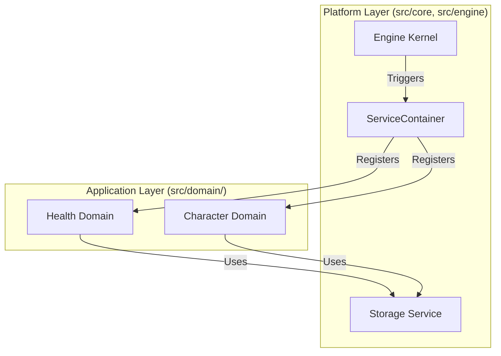

# Platform-Oriented Architecture

**Platform-Oriented Architecture** is a design philosophy where the primary system is built as a reusable, extensible "Platform" (the Engine) that provides core capabilities to independent, pluggable "Applications" (the Domains).

## Core Principles

1.  **Shared Capabilities**: The platform provides common utilities like asset loading, event handling, and persistence.
2.  **Kernel/Plugin Relationship**: The Platform (Kernel) defines the lifecycle and orchestration, while the Modules (Plugins) provide the specific game logic.
3.  **Inversion of Control (IoC)**: The Platform calls the Modules; the Modules do not drive the execution flow of the Platform.

## Implementation in Oregon Trail

In this architecture, the `ServiceContainer` is the central "switchboard" of the platform.



## Benefits

-   **Scalability**: New game mechanics can be added without modifying the Engine's core code.
-   **Consistency**: All domains use the same platform utilities (Asset Loading, Logging, Storage), ensuring unified behavior.
-   **Future-Proofing**: The engine can be reused for other games by swapping out the domain modules.

## Example: The Platform API

The Platform provides an API through **Architecture Contracts**. A domain module "plugs in" to the platform by implementing these contracts.

```python
# The Platform (Engine) provides the contract
class BaseServiceProvider(ABC):
    def register(self, container):
        """Standard hook for a domain to 'sign up' for platform services."""
        pass

# The Application (Domain) implements the hook
class HealthServiceProvider(BaseServiceProvider):
    def register(self, container):
        # The platform provides the storage and event services
        container.bind("health_storage", StorageService())
        container.bind("health_events", EventManager())
```
