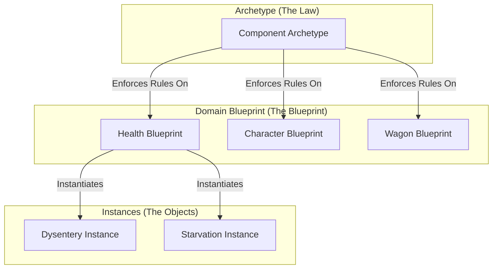

# Standardized Component Archetype

A **Standardized Component Archetype** is a high-level, abstract model that defines the essential characteristics, behaviors, and constraints of a specific category of components. It is a "blueprint of a blueprint."

## Taxonomy

| Attribute | Classification |
| :--- | :--- |
| **Category** | **Architectural Meta-Pattern** |
| **Abstraction** | **Metamodel / Conceptual** |
| **Primary Goal** | Define the **Semantic Laws** and **Constraints** for all system components. |

## Role in Architecture

The Archetype is the "Law." It does not dictate how to build a specific feature, but rather mandates what *every* feature of a certain type must be. In the Oregon Trail engine, the **Universal Domain Blueprint (UDB)** is the project-specific implementation of this archetype.



## Benefits

-   **Predictable Integration**: The Engine (Kernel) can treat all domains polymorphically because they all "sign the same contract."
-   **Structural Integrity**: Prevents "snowflake" modules that deviate from the system's design principles.
-   **Generic Orchestration**: Allows for the creation of a universal `Orchestrator` that doesn't need to know the specifics of a domain to run it.

## Python Example: Defining the Archetype

The archetype is often implemented using Python's `Protocol` or `ABC` (Abstract Base Classes) to define the "plug shapes."

```python
from typing import Protocol, runtime_checkable

@runtime_checkable
class DomainArchetype(Protocol):
    """
    The 'Law' for all Domain Packages in Oregon Trail.
    Every domain MUST provide an Orchestrator and a Transformer.
    """
    def orchestrate(self, entity: any) -> None:
        """The Managerial Port: Coordinates state and logic."""
        ...

    def transform(self, state: any, blueprint: any) -> any:
        """The Mathematical Port: Pure transformation logic."""
        ...

# The Architecture then mandates that all sub-systems follow this Archetype:
def validate_domain(domain: object):
    if not isinstance(domain, DomainArchetype):
        raise TypeError("Module does not follow the Standardized Component Archetype!")
```
