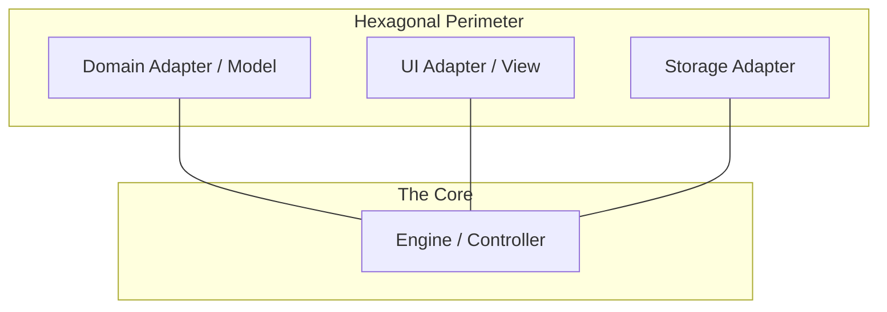

# MVC vs. Hexagonal Architecture

This project employs a **Hybrid Architecture** that combines the organizational strengths of **MVC** with the isolation and decoupling of **Hexagonal Architecture (Ports & Adapters)**.

## 1. MVC: The Organizational Hierarchy

MVC (Model-View-Controller) focuses on the **internal responsibility** of components. It answers the question: "What is this component's role in the system?"

-   **Model**: The Domain (Data and Logic).
-   **View**: The UI (Presentation).
-   **Controller**: The Engine (Orchestration).

### Best Use-Cases for MVC:
-   Standard web applications.
-   Clear hierarchical structures.
-   When the relationship between data, logic, and UI is direct and straightforward.

---

## 2. Hexagonal: The Boundary Pattern

Hexagonal Architecture focuses on the **external boundaries** and decoupling the **Core** from its dependencies. It answers the question: "How does the system talk to the outside world?"

-   **The Core (Inside)**: The Engine Kernel. It defines **Ports** (Protocols).
-   **The Adapters (Outside)**: Domain Packages, UI, Storage. They plug into the Ports.

### Best Use-Cases for Hexagonal:
-   Systems requiring high testability (can mock any adapter).
-   Plugin-based architectures (like a game engine with many domains).
-   When the technology (DB, UI) is likely to change or needs to be swapped.

---

## 3. How They Work Together (The Hybrid Approach)

In Oregon Trail, the two architectures are mapped together to create a robust system:

| Layer | MVC Role | Hexagonal Role | Responsibility |
| :--- | :--- | :--- | :--- |
| **Engine Kernel** | **Controller** | **The Core** | Orchestrates the flow and defines the Protocols (Ports). |
| **Domain Packages** | **Model** | **Adapters** | Implements the game logic and "plugs into" the Engine. |
| **UI Components** | **View** | **Adapters** | Handles interaction without knowing the Core logic. |

---

## 4. When They Should NOT Work Together

Combining these patterns adds complexity. You should avoid the hybrid approach if:
1.  **The Project is Small**: A simple script or small utility doesn't need the overhead of Hexagonal boundaries.
2.  **Performance is Absolute**: The extra layers of indirection (Protocols/Adapters) can introduce minor overhead (usually negligible in a text-based game).
3.  **Tightly Coupled Logic**: If your logic is deeply entwined with your UI or Database, trying to force Hexagonal boundaries will lead to "Over-Engineering" and frustration.

## 5. Summary

-   **MVC** organizes your code by **layer**.
-   **Hexagonal** protects your code by **boundary**.
-   **Together**, they ensure that the Oregon Trail engine is both easy to understand and extremely modular.
of the game (Services).
ency Leaf Policy)
An architectural constraint where "leaf" modules (the most granular functional units, like `health` or `wagon`) are prohibited from depending on or importing any sibling modules. All cross-module interaction must be orchestrated by a higher-level layer (the Engine).

## M
### Microkernel Architecture
An architectural pattern that separates a minimal functional core (the kernel) from extended game logic and features (plugins). In this project, the `ServiceContainer` and `Engine` act as the kernel, while domain packages like `health` and `character` act as plugins.

### Modular Architecture
An industry-standard practice of breaking a system into independent, interchangeable parts with strict boundaries. This enforces the "Zero-Dependency Leaf Policy," ensuring that individual domain packages (like `health`) remain isolated and testable.

### Modular Kernel (Orchestrator)
The core "Engine" that coordinates various domains' execution without knowing their internal details. It interacts only with the **Architecture Contracts** (Ports) to trigger game logic.

### Module
In Python, a single `.py` file containing code. In a larger architectural sense, it refers to a discrete unit of functionality that can be independently developed and tested.

## P
### Package
In Python, a directory containing an `__init__.py` file and one or more modules. It provides a way to structure the project's namespace and group related functionality.

### Platform-Oriented Architecture
A design philosophy where the system is built as a reusable "Platform" (the Engine) that provides core services (lifecycle, storage, events), while specific game mechanics are implemented as "Applications" or "Features" that run on top of it.

## S
### Screaming Architecture
An organizational pattern where the folder structure "screams" the purpose of the application (e.g., `domain/health/`, `domain/character/`) rather than the technical tools used (e.g., `models/`, `views/`, `controllers/`).

### Service Provider Pattern
A pattern used to handle the two-phase lifecycle (**Register** and **Boot**) of a module. Service Providers are responsible for wiring a domain's logic and assets into the **DI Container**.

### Standardized Component Archetype
An architectural pattern that mandates a uniform internal structure and interface for all components within a system. This ensures predictable integration and enables polymorphic orchestration by the host environment or engine.

## U
### Universal Domain Blueprint (UDB)
A project-specific internal term for the implementation of a **Standardized Component Archetype**. It mandates that every domain package (e.g., `health`, `character`) follows a specific structural contract (Assets -> Registry -> Service -> Provider) to ensure compatibility with the Oregon Trail engine.

## Z
### Zero-Dependency
A design principle where a component is built to have no external dependencies on other functional components of the same level. This maximizes portability, testability, and decoupling within the system.
