# Glossary

This document defines the architectural terms and design patterns used in the Oregon Trail engine. Using industry-standard terminology ensures consistency and clarity for developers.

## A
### Aggregate Roots
A concept from Domain-Driven Design (DDD) where a cluster of associated objects is treated as a single unit for data changes. An Aggregate Root is the "entry point" to the cluster, ensuring all internal consistency rules are met.

1. Relationship to [Screaming MVC Architecture](#screaming-architecture):

    * The **Aggregate Root** is not just a single class; it is the *Sovereign Ruler* of a [**Bounded Context**](#bounded-context).

    * **Implementation** of the Screaming Interface: A *facade* is declared via the `__init__.py` of the AR. The **Aggregate Root** is the *Package* itself. By using the __init__.py to "lift" logic from nested sub-details, you create a Facade that represents the entire Aggregate Root to the rest of the application.

2. Definition of **Sovereign Territory**:

    * The **Bounded Context** defines the physical borders of the Aggregate Root's kingdom.

    * The [**Standalone Concept**](#standalone-concept) is the reason the kingdom exists (e.g., "Trading")

    * The Relationship: You CANNOT have an Aggregate Root without a Bounded Context. The Aggregate Root is the "Entry Point" that ensures that when you cross the border into the "Trading" context, you follow the Trading rules and no others.

3. Protecting Internal Consistency:

    * The Purpose: To ensure that the "cluster of objects" stays valid and doesn't fall into an impossible state.

    * [**Sub-details (Internal Identities)**](#internal-identity) are the subjects living inside the kingdom (Boundary Context). They are "private" and fragile.

    * [**Encapsulation**](#encapsulation) is the castle wall. It prevents the outside world (The Engine) from reaching in and manually changing a sub-detail without the AR's permission. The AR uses Encapsulation to hide its Sub-details. If the Engine wants to change a sub-detail, it must ask the AR. This ensures that the internal state remains consistent.

4. Role of the Aggregate Root:

    * Acts as the "Gatekeeper" and the primary interface for any interaction with that domain.

    * [**Domain Intent**](#domain-intent) is the AR's "Scream." It is the list of high-level actions the AR can perform.

    * The AR's role is to maximize [**Discovery**](#discovery) of the Domain Intent. Instead of the Engine having to "discover" 50 small files, it only has to find the Aggregate Root to know exactly what that domain is capable of doing.


**Relationship Diagram**

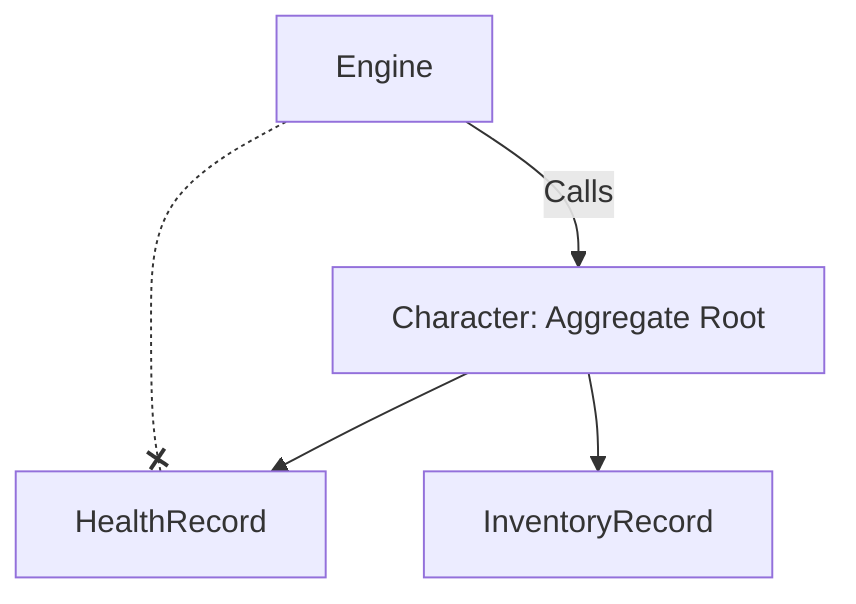

**Compliamentary Directory Structure**

```text
src/
├── engine/                   <-- The Controller
│   └── game_loop.py          <-- Calls character.apply_injury()
│
└── domain/                   <-- The Bounded Contexts
    └── character/            <-- THE AGGREGATE ROOT (Standalone Concept)
        ├── __init__.py       <-- THE FACADE: Lifts "Intent" (e.g., apply_injury)
        ├── models.py         <-- CharacterEntity (The entry point)
        ├── services.py       <-- Orchestrates internal consistency
        │
        └── internal/         <-- SUB-DETAILS (Hidden from Discovery)
            ├── health/       
            │   ├── __init__.py
            │   ├── models.py <-- HealthRecord
            │   └── logic.py  <-- Health calculation math
            │
            └── inventory/    
                ├── __init__.py
                ├── models.py <-- InventoryRecord
                └── logic.py  <-- Weight/Capacity math
```

### Anemic Domain Model
A design pattern where domain objects (Entities) contain data but little or no logic (behavior). In this model, the "verbs" or game mechanics are moved into separate Service or Logic classes, leaving the Entities as simple data containers.

```python
@dataclass
class HealthRecord:  # Pure data container
    current_hp: int
    max_hp: int

def apply_damage(record: HealthRecord, amount: int): # Logic elsewhere
    record.current_hp -= amount
```

### Anti-Pattern
A common response to a recurring problem that is usually ineffective and risks being highly counterproductive. It is a "documented bad habit" that should be avoided to maintain system health.

```python
# Example: The "God Object" Anti-Pattern
class GameController:
    def handle_input(self): ...
    def calculate_physics(self): ...
    def render_graphics(self): ...
    def save_to_database(self): ...
```

### Architecture Contract (Service Contract)
A formal definition of the "plug shape" that a module or domain must take to be compatible with the engine. It dictates the required interfaces (Protocols) that a component must implement to "sign the contract" with the system.

```python
class DomainBinding(Protocol):
    def orchestrate(self, entity: any) -> None: ...
    def transform(self, state: any, blueprint: any) -> any: ...
```

## B

### Bounded Context

Represents the *Border Control* of your domain. It is the linguistic and logical boundary within which a specific model or term has a single, unambiguous meaning. It is the WHERE to the WHY of [Domain Intent](#domain-intent) and the WHAT of a [Standalone Concept](#standalone-concept)

## C
### Component Template
A reusable structural pattern that defines the mandatory files, classes, or interfaces that a module must implement. It acts as a "scaffold" for new features, ensuring consistency across a large codebase.

```text
domain/my_feature/
├── models.py
├── logic.py
├── service.py
└── provider.py
```

### Conceptual Hierarchy
How the logic is percieved - which is not necessarily how the files are structurally arranged

### Contract-First Design
A development methodology where the interfaces and interaction rules (the "contracts") are defined before writing any implementation logic. This ensures that different systems (e.g., Health and Character domains) can integrate seamlessly.

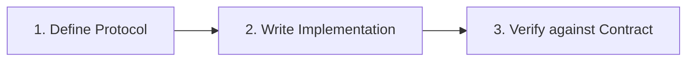

## D
### Dependency Injection (DI) Container
A central object (often called a `ServiceContainer`) that manages the instantiation and lifecycle of services. Instead of components creating their own dependencies, the container "injects" them, allowing for easier testing and modularity.

```python
container = ServiceContainer()
container.register(HealthService, lambda c: HealthService())
service = container.resolve(HealthService)
```

### Discovery

Making a feature easy to find. It is the clarity of the *Public API*. If a package has high discovery, its "Scream" is unmistakable; the entry point is obvious, and the naming reflects the business intent perfectly.

1. **Implementation**: You facilitate discovery through the `__init__.py`. By "lifting" the most important functions from the sub-details up to the package level, you create a flat, readable menu of options. See [Encapsulation](#encapsulation)

### Domain Intent

The *Business Why*. It is the pure, conceptual goal that a piece of code is trying to achieve for the user, stripped of all technical jargon, file paths, or mathematical complexity.

Why **Intent** MUST be protected:

1. Prevents **Logic Leakage**: If the Engine has to know about "friction coefficients" to help the wagon cross a river, the Engine is no longer just "controlling the game"—it’s now doing "physics."

2. Reduces **Tight Coupling**: If you change your physics engine later, you'd have to rewrite the Engine. But if you protect the Intent (ford_river), you can change the math entirely behind the scenes, and the Engine never has to change a single line of code. It still just wants to "ford the river."

### Domain Archetype (System Archetype)
A structural template or "recipe" that mandates every functional sub-system must implement a specific set of components (e.g., Blueprint, State, Logic, Service). This ensures that all domains are structurally identical from the engine's perspective.

```text
Archetype
├── Entity (The Data)
├── Logic (The Rules)
├── Service (The Hand)
└── Provider (The Glue)
```

### Domain-Driven Design (DDD)
An approach to software development that centers the design on the "Domain" (the core logic of the Oregon Trail). It uses concepts like **Entities**, **Value Objects**, and [**Bounded Contexts**](#bounded-context) to organize complex logic.

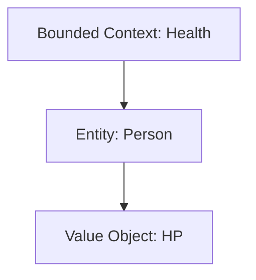

### Domain Driven Model (Rich Domain Model)
An approach where domain objects (Entities) encapsulate both state and the behavior related to that state. This is the opposite of an Anemic Domain Model, as the logic "lives" where the data resides.

```python
class HealthRecord:
    def apply_damage(self, amount: int):
        self.current_hp -= amount  # Behavior inside the model
```

## E

### Encapsulation

The practice of hiding the "How" ([the internal sub-details](#internal-identity)) to protect the "What" ([the domain's intent](#domain-intent)).

Encapsulation helps the Orchestrator via the Parent *Fascade* by hiding the *mess* so that the Orchestrator cannot accidentally access methods or entities which are not part of its remit. It accomplished this via the [**Discovery** path](#discovery) e.g. `parent.get_hidden_method()` where `get_hidden_method()` is NOT exposed by-itself

This reduces the *Cognative Load* on the Orchestrator/Engine.

## I

### Internal Identity
**(Implementation Detail, Sub-detail)**

A piece of logic or data that has no meaning—and no right to exist—outside of its parent. Is exists solely to support the internal requirements of a specific Aggregate Root. It is "private" to its parent. This is Nested logic. It lives inside a domain folder and is never exported by the `__init__.py` to the rest of the app.

1. **Use with [Screaming Architecture](#screaming-architecture)**: 

    Sub-details are what allow Screaming Architecture to scale without becoming a mess. The *Screaming* Parent defined the [**Boundary Context**](#bounded-context) in-which the Internal Identity can exist.

    Without *Screaming Architecture* such sub-details are religated to a `utils/` or `helpers/` directory

2. The `__init__.py` **Lifting Mechanism**:

    The Parent becomes the *Fascade* for the Implementation Detail. See [Discovery](#discovery) [Encapsulation](#encapsulation)

### Inversion of Control (IoC)
An architectural principle where the program's flow is inverted: instead of the domain logic calling the framework, the framework (the engine) calls the domain logic via predefined contracts (the Domain Protocol).

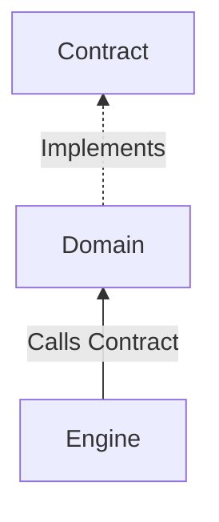

## K

### Kernel

The core component of a system that manages the relationship between different parts (like hardware and software, or in your case, the Engine and the Domain). It acts as the "Standard Library" and "Central Dispatcher."

## L
### Leaf-Policy (Zero-Dependency Leaf Policy)
An architectural constraint where "leaf" modules (the most granular functional units, like `health` or `wagon`) are prohibited from depending on or importing any sibling modules. All cross-module interaction must be orchestrated by a higher-level layer (the Engine).

See also [Structural Siblings](#structural-siblings) and [Conceptual Hierarchy](#conceptual-hierarchy)

**The Abstract Leaf Policy**

In this model, "Leaf A" and "Leaf B" are Siblings. They are both "dumb" units of logic that perform a specific task. They never "see" each other. They only see the Orchestrator.

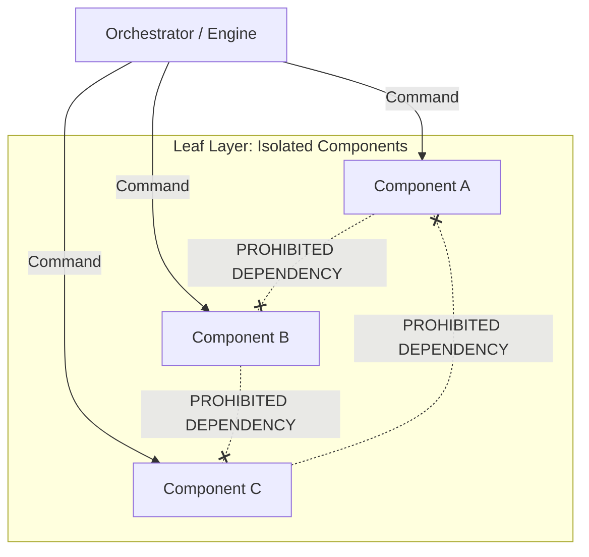

**Associated Structural Sibling Tree**

```text
src/
├── orchestrator/             <-- The ONLY layer allowed to see all leaves
│   ├── __init__.py
│   └── controller.py         <-- Coordinates data flow between A, B, and C
│
└── domain/                   <-- The "Leaf Layer" (Siblings)
    ├── component_a/          <-- Isolated Leaf
    │   ├── __init__.py       <-- Public API for Leaf A
    │   ├── models.py         <-- Data specific to A
    │   └── logic.py          <-- Pure functions for A
    │
    ├── component_b/          <-- Isolated Leaf
    │   ├── __init__.py       <-- Public API for Leaf B
    │   ├── models.py
    │   └── logic.py
    │
    └── component_c/          <-- Isolated Leaf
        ├── __init__.py       <-- Public API for Leaf C
        ├── models.py
        └── logic.py
```

**How they "Talk" (The Orchestration Flow)**

If Component B needs information that only Component A has, the Orchestrator acts as the middleman. This prevents a "Spiderweb" of dependencies.

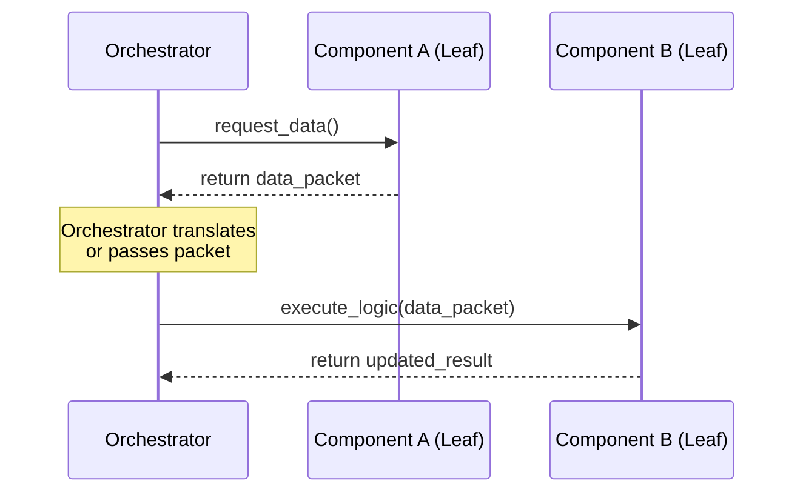

## M
### Microkernel Architecture
An architectural pattern that separates a minimal functional core (the kernel) from extended game logic and features (plugins). In this project, the `ServiceContainer` and `Engine` act as the kernel, while domain packages like `health` and `character` act as plugins.

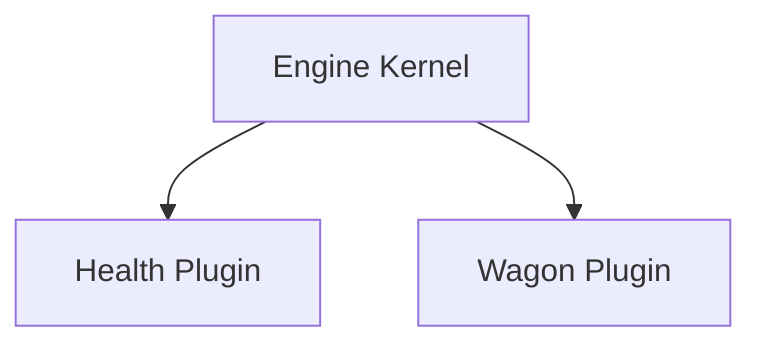

### Modular Architecture
An industry-standard practice of breaking a system into independent, interchangeable parts with strict boundaries. This enforces the "Zero-Dependency Leaf Policy," ensuring that individual domain packages (like `health`) remain isolated and testable.

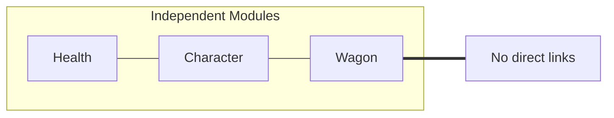

### Modular Kernel (Orchestrator)
The core "Engine" that coordinates various domains' execution without knowing their internal details. It interacts only with the **Architecture Contracts** (Ports) to trigger game logic.

```python
class Engine:
    def tick(self):
        for domain in self.domains:
            domain.orchestrate(self.state) # polymorphic call
```

### Module
In Python, a single `.py` file containing code. In a larger architectural sense, it refers to a discrete unit of functionality that can be independently developed and tested.

```python
# logic.py (A Module)
def do_math(x, y):
    return x + y
```

## P
### Package
In Python, a directory containing an `__init__.py` file and one or more modules. It provides a way to structure the project's namespace and group related functionality.

```text
src/domain/health/  <-- This is a Package
├── __init__.py
├── models.py
└── logic.py
```

### Platform-Oriented Architecture
A design philosophy where the system is built as a reusable "Platform" (the Engine) that provides core services (lifecycle, storage, events), while specific game mechanics are implemented as "Applications" or "Features" that run on top of it.

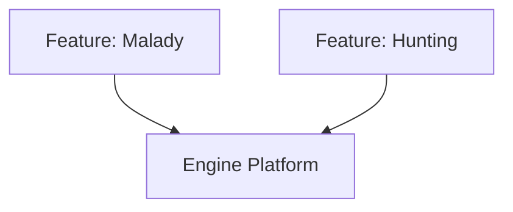

## S
### Screaming Architecture
**(Feature-Driven)**

An organizational pattern where the folder structure "screams" the purpose of the application (e.g., `domain/health/`, `domain/character/`) rather than the technical tools used (e.g., `models/`, `views/`, `controllers/`).

```text
src/
├── domain/
│   ├── health/
│   └── wagon/
└── ui/
```

### Shared Kernel
**(Common Entity)**

A centralized architectural layer used to house domain elements. 

It serves as a "common language" or shared library that prevents logic duplication and circular dependencies, ensuring that universal concepts (like Money, Weight, or Coordinates) remain consistent across the entire system without being trapped inside a single specific package.

**Key Characteristics**

* **Location:** Typically organized in a directory like src/domain/common/ or src/domain/shared/.

* **Content:** Limited to pure, stateless objects and semantic bundles that have high reuse value.

* **Purpose:** To mitigate "Common-itis" (the tendency for a generic common folder to become a dumping ground) by strictly limiting its scope to shared domain primitives.

* **Coordination:** Because it is shared, changes to the Kernel require agreement across all domains that depend on it to prevent breaking downstream logic.

### Service Provider Pattern
A pattern used to handle the two-phase lifecycle (**Register** and **Boot**) of a module. Service Providers are responsible for wiring a domain's logic and assets into the **DI Container**.

```python
class HealthProvider(BaseServiceProvider):
    def register(self):
        self.container.bind(HealthService, ...)
    def boot(self):
        # Cross-service initialization
```

### Standalone Concept

A unit of logic and data that is useful in isolation and has its own [**Bounded Context**](#bounded-context).

In modular architecture, a Standalone Concept is a domain that is *Self-Sovereign*. It provides a specific service that could *theoretically* be used by any other part of the system without knowing who is asking.

### Standardized Component Archetype
An architectural pattern that mandates a uniform internal structure and interface for all components within a system. This ensures predictable integration and enables polymorphic orchestration by the host environment or engine.

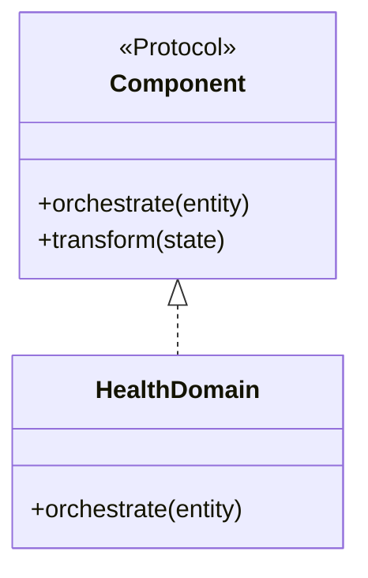

### Structural Siblings

Where the code lives within the directory structure.

Example of...

```text

```

### System Kernel

The specific implementation of the kernel for your software. In your clone, this is the Core—the part that handles bootstrapping, the ServiceContainer, and the message bus. It is the "Laws of Physics" for your game.

[See Kernel](#kernel)

## U
### Universal Domain Blueprint (UDB)
A project-specific internal term for the implementation of a **Standardized Component Archetype**. It mandates that every domain package (e.g., `health`, `character`) follows a specific structural contract (Assets -> Registry -> Service -> Provider) to ensure compatibility with the Oregon Trail engine.

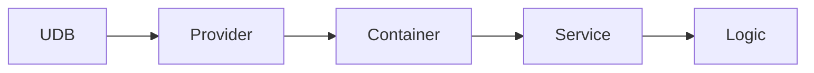

## Z
### Zero-Dependency
A design principle where a component is built to have no external dependencies on other functional components of the same level. This maximizes portability, testability, and decoupling within the system.

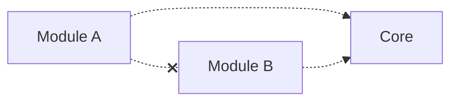
