# Glossary

This document defines the architectural terms and design patterns used in the Oregon Trail engine. Using industry-standard terminology ensures consistency and clarity for developers.

## A
### Aggregate Roots
A concept from Domain-Driven Design (DDD) where a cluster of associated objects is treated as a single unit for data changes. An Aggregate Root is the "entry point" to the cluster, ensuring all internal consistency rules are met.

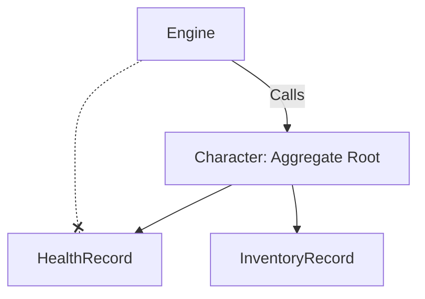

### Anemic Domain Model
A design pattern where domain objects (Entities) contain data but little or no logic (behavior). In this model, the "verbs" or game mechanics are moved into separate Service or Logic classes, leaving the Entities as simple data containers.

```python
@dataclass
class HealthRecord:  # Pure data container
    current_hp: int
    max_hp: int

def apply_damage(record: HealthRecord, amount: int): # Logic elsewhere
    record.current_hp -= amount
```

### Anti-Pattern
A common response to a recurring problem that is usually ineffective and risks being highly counterproductive. It is a "documented bad habit" that should be avoided to maintain system health.

```python
# Example: The "God Object" Anti-Pattern
class GameController:
    def handle_input(self): ...
    def calculate_physics(self): ...
    def render_graphics(self): ...
    def save_to_database(self): ...
```

### Architecture Contract (Service Contract)
A formal definition of the "plug shape" that a module or domain must take to be compatible with the engine. It dictates the required interfaces (Protocols) that a component must implement to "sign the contract" with the system.

```python
class DomainBinding(Protocol):
    def orchestrate(self, entity: any) -> None: ...
    def transform(self, state: any, blueprint: any) -> any: ...
```

## C
### Component Template
A reusable structural pattern that defines the mandatory files, classes, or interfaces that a module must implement. It acts as a "scaffold" for new features, ensuring consistency across a large codebase.

```text
domain/my_feature/
├── models.py
├── logic.py
├── service.py
└── provider.py
```

### Contract-First Design
A development methodology where the interfaces and interaction rules (the "contracts") are defined before writing any implementation logic. This ensures that different systems (e.g., Health and Character domains) can integrate seamlessly.

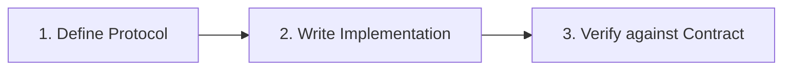

## D
### Dependency Injection (DI) Container
A central object (often called a `ServiceContainer`) that manages the instantiation and lifecycle of services. Instead of components creating their own dependencies, the container "injects" them, allowing for easier testing and modularity.

```python
container = ServiceContainer()
container.register(HealthService, lambda c: HealthService())
service = container.resolve(HealthService)
```

### Domain Archetype (System Archetype)
A structural template or "recipe" that mandates every functional sub-system must implement a specific set of components (e.g., Blueprint, State, Logic, Service). This ensures that all domains are structurally identical from the engine's perspective.

```text
Archetype
├── Entity (The Data)
├── Logic (The Rules)
├── Service (The Hand)
└── Provider (The Glue)
```

### Domain-Driven Design (DDD)
An approach to software development that centers the design on the "Domain" (the core logic of the Oregon Trail). It uses concepts like **Entities**, **Value Objects**, and **Bounded Contexts** to organize complex logic.

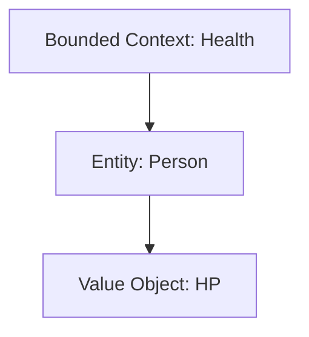

### Domain Driven Model (Rich Domain Model)
An approach where domain objects (Entities) encapsulate both state and the behavior related to that state. This is the opposite of an Anemic Domain Model, as the logic "lives" where the data resides.

```python
class HealthRecord:
    def apply_damage(self, amount: int):
        self.current_hp -= amount  # Behavior inside the model
```

## I
### Inversion of Control (IoC)
An architectural principle where the program's flow is inverted: instead of the domain logic calling the framework, the framework (the engine) calls the domain logic via predefined contracts (the Domain Protocol).

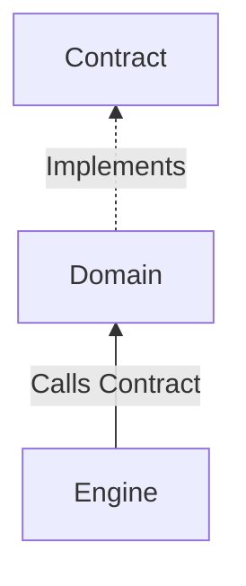

## L
### Leaf-Policy (Zero-Dependency Leaf Policy)
An architectural constraint where "leaf" modules (the most granular functional units, like `health` or `wagon`) are prohibited from depending on or importing any sibling modules. All cross-module interaction must be orchestrated by a higher-level layer (the Engine).

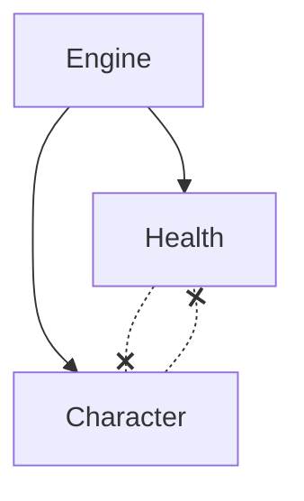

## M
### Microkernel Architecture
An architectural pattern that separates a minimal functional core (the kernel) from extended game logic and features (plugins). In this project, the `ServiceContainer` and `Engine` act as the kernel, while domain packages like `health` and `character` act as plugins.

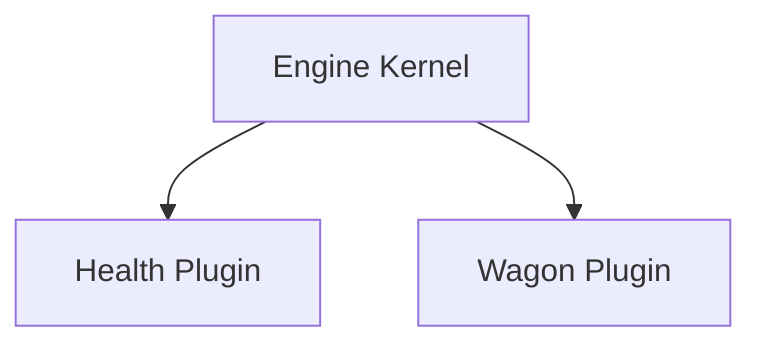

### Modular Architecture
An industry-standard practice of breaking a system into independent, interchangeable parts with strict boundaries. This enforces the "Zero-Dependency Leaf Policy," ensuring that individual domain packages (like `health`) remain isolated and testable.

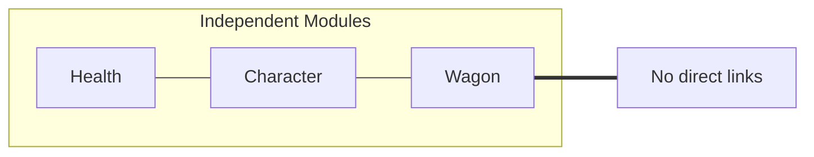

### Modular Kernel (Orchestrator)
The core "Engine" that coordinates various domains' execution without knowing their internal details. It interacts only with the **Architecture Contracts** (Ports) to trigger game logic.

```python
class Engine:
    def tick(self):
        for domain in self.domains:
            domain.orchestrate(self.state) # polymorphic call
```

### Module
In Python, a single `.py` file containing code. In a larger architectural sense, it refers to a discrete unit of functionality that can be independently developed and tested.

```python
# logic.py (A Module)
def do_math(x, y):
    return x + y
```

## P
### Package
In Python, a directory containing an `__init__.py` file and one or more modules. It provides a way to structure the project's namespace and group related functionality.

```text
src/domain/health/  <-- This is a Package
├── __init__.py
├── models.py
└── logic.py
```

### Platform-Oriented Architecture
A design philosophy where the system is built as a reusable "Platform" (the Engine) that provides core services (lifecycle, storage, events), while specific game mechanics are implemented as "Applications" or "Features" that run on top of it.

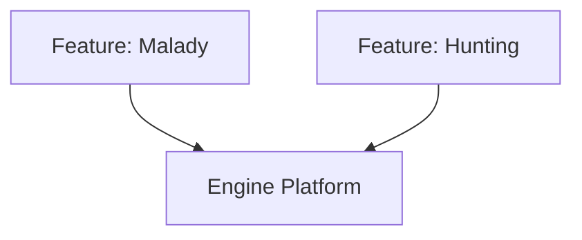

## S
### Screaming Architecture
An organizational pattern where the folder structure "screams" the purpose of the application (e.g., `domain/health/`, `domain/character/`) rather than the technical tools used (e.g., `models/`, `views/`, `controllers/`).

```text
src/
├── domain/
│   ├── health/
│   └── wagon/
└── ui/
```

### Service Provider Pattern
A pattern used to handle the two-phase lifecycle (**Register** and **Boot**) of a module. Service Providers are responsible for wiring a domain's logic and assets into the **DI Container**.

```python
class HealthProvider(BaseServiceProvider):
    def register(self):
        self.container.bind(HealthService, ...)
    def boot(self):
        # Cross-service initialization
```

### Standardized Component Archetype
An architectural pattern that mandates a uniform internal structure and interface for all components within a system. This ensures predictable integration and enables polymorphic orchestration by the host environment or engine.

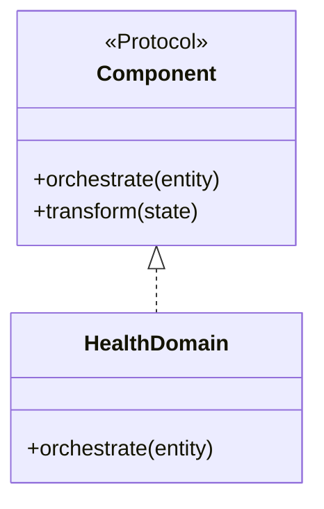

## U
### Universal Domain Blueprint (UDB)
A project-specific internal term for the implementation of a **Standardized Component Archetype**. It mandates that every domain package (e.g., `health`, `character`) follows a specific structural contract (Assets -> Registry -> Service -> Provider) to ensure compatibility with the Oregon Trail engine.

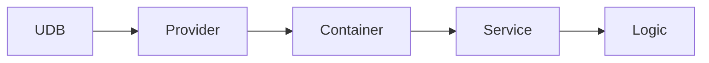

## Z
### Zero-Dependency
A design principle where a component is built to have no external dependencies on other functional components of the same level. This maximizes portability, testability, and decoupling within the system.

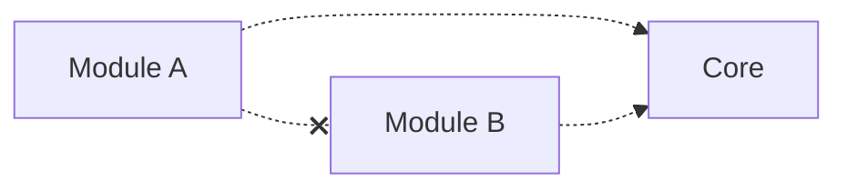
