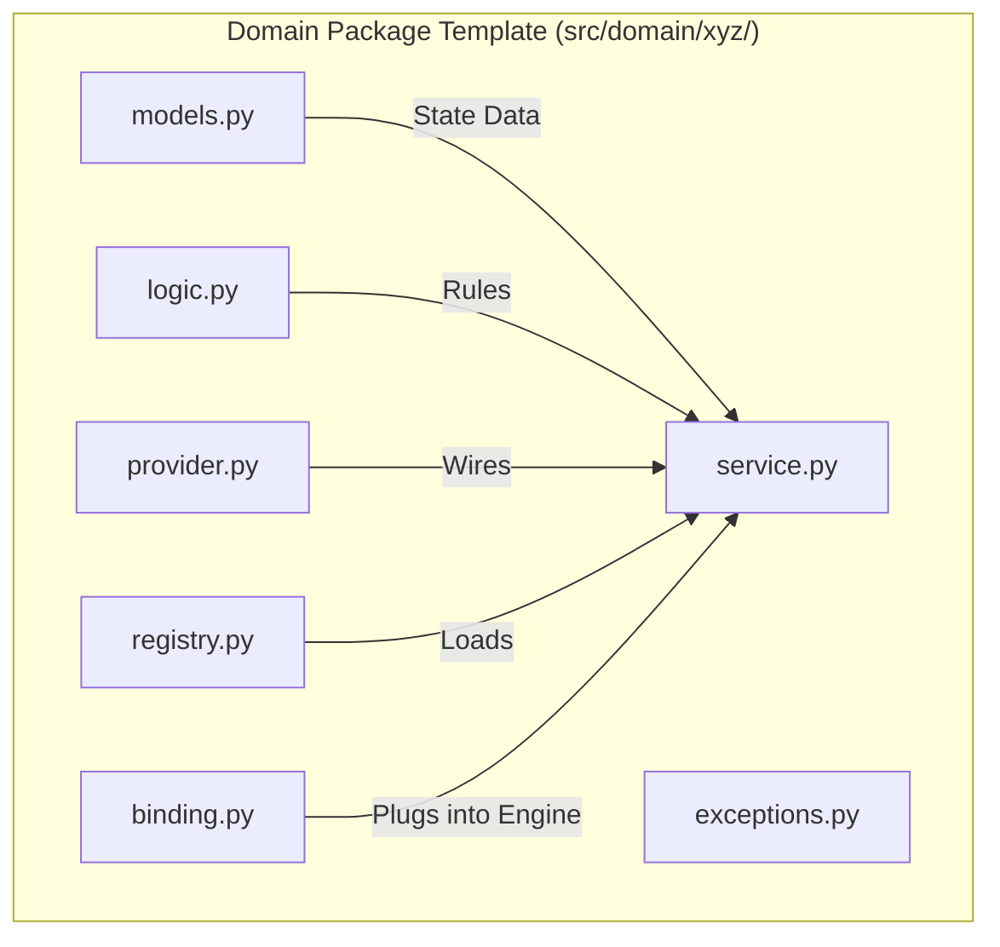

# Component Template

A **Component Template** is a concrete, implementation-oriented specification used to scaffold or generate a specific module. It provides a "starter kit" or "shell" that ensures every implementation follows the structural rules defined by the Architecture.

## Taxonomy

| Attribute | Classification |
| :--- | :--- |
| **Category** | **Structural Implementation Pattern** |
| **Abstraction** | **Concrete / Scaffold** |
| **Primary Goal** | Provide a **Standardized Layout** and **Implementation Shell** for features. |

## Role in Architecture

While the Archetype defines the "Law" (What it must be), the Template provides the "Blueprint" (How it is built). In the Oregon Trail project, the Component Template mandates the exact file structure and base classes for every domain package.



## Benefits

-   **Developer Velocity**: New domains can be scaffolded in seconds by following the template.
-   **Easier Maintenance**: A developer looking at the `health` domain knows exactly where to find the logic for the `wagon` domain, as the structure is identical.
-   **Boilerplate Reduction**: Base classes can provide common functionality, leaving the developer to focus on domain-specific code.

## Python Example: Implementing the Template

The template is often realized as a set of base classes that every new module must inherit from.

### 1. The Service Provider (Technical Wiring)
The `provider.py` handles the construction of the domain's services and their registration with the `ServiceContainer`.

```python
class HealthServiceProvider(BaseServiceProvider):
    def register(self):
        # Implementation of the registration phase
        self.container.bind("health_service", HealthService())

    def boot(self):
        # Implementation of the bootstrapping phase
        pass
```

### 2. The Domain Binding (Functional Wiring)
The `binding.py` handles the runtime orchestration by the `Engine`.

```python
class HealthBinding(DomainBinding[Healthable, HealthState, MaladyBlueprint]):
    def orchestrate(self, entity: Healthable):
        # The Binding 'glues' the Engine to the Domain Service
        service = self.container.resolve("health_service")
        service.process_health(entity)
```
