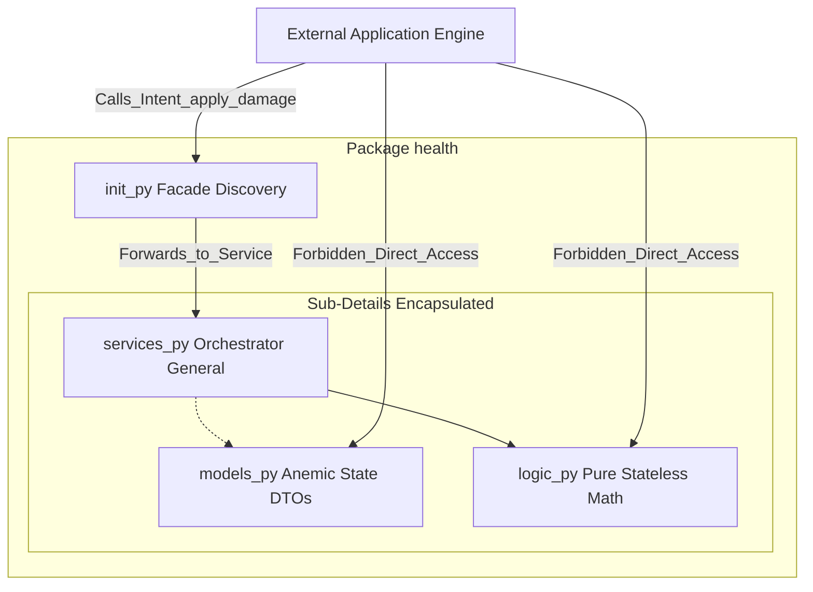
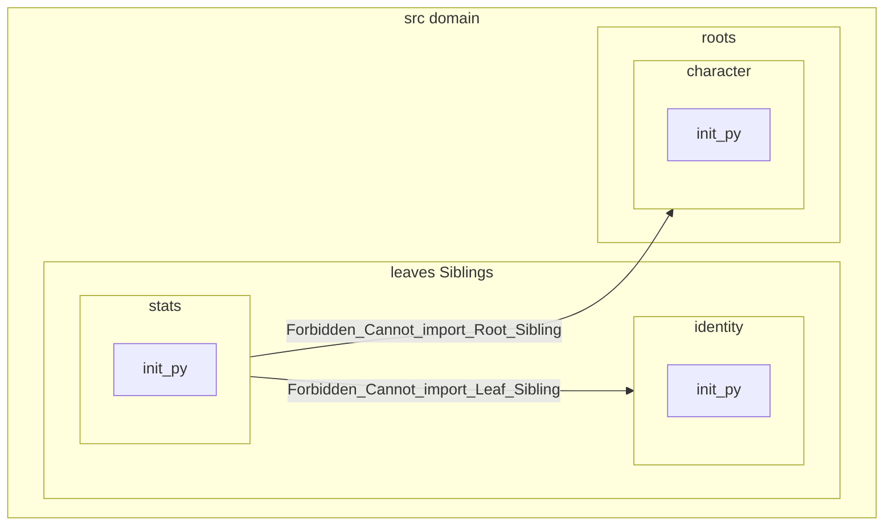
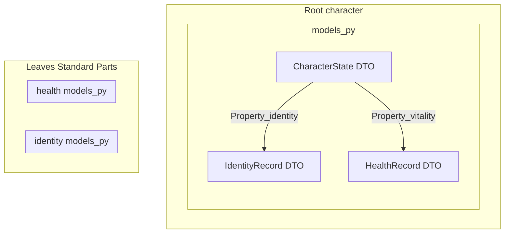
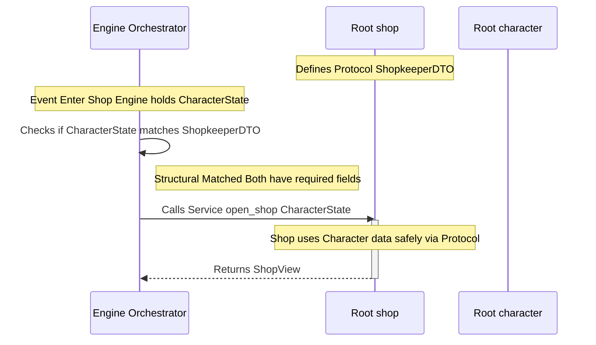

# Domain Taxonomy

## Context

A taxonomy with strict definitions is necessary to explicitly maintain architecture patterns.

## Decisions

### 1. The Fundamental Unit: The Package

A Package is any directory located within src/domain/<package_name>/. It represents a Standalone Concept and a Sovereign Bounded Context.

    The Facade (__init__.py): Every package MUST contain an __init__.py. This file is the "Voice" of the domain. It manages Discovery (lifting important functions to the top level) and Encapsulation (hiding internal noise).

    The Scream: Package names must explicitly declare their Domain Intent (e.g., /health, /navigation).

**Fundamental Unit: Package Diagram**

### 2. The Anatomy of an Anemic Aggregate

Every package is composed of three primary sub-details that separate State, Math, and Orchestration.

| Component | File | Role | Behavioral Rule |
| :--- | :--- | :--- | :--- |
| **Model** | `models.py` | Anemic State | Pure DTOs. Zero logic. Cannot manipulate their own state. |
| **Logic** | `logic.py` | Domain Verbs | Pure, stateless functions. The "Math" of the domain. |
| **Service** | `services.py` | Orchestration | The "General." Coordinates data flow and external interactions. |

### 3. Structural Sibling Classification

All packages are **Structural Siblings** on the filesystem but are classified into two categories to govern dependency flow.
1. **Leaf Packages** (The Atoms)

    Definition: Granular, standalone functional units (e.g., identity, stats).

    Zero-Dependency Leaf Policy: A Leaf is strictly prohibited from importing or depending on any other Leaf or Root. It is a "Pure Actor."

**Diagram of Leaf**

2. **Root Packages** (The Assemblies)

    Definition: Conceptual Aggregate Roots that cluster associated objects into a single unit (e.g., character, shop).

    The Parent Rule: Roots CAN import and depend on Leaf Models to facilitate Conceptual Hierarchy through DTO-Import.

**Root Package Diagram**

### 4. The Laws of Dependency & Interaction
Rule 1: Vertical Composition (Allowed)

Roots may import Models from Leaves to create complex data structures.

    Example: CharacterState (Root) can contain a HealthRecord (Leaf).

Rule 2: Horizontal Isolation (Forbidden)

Leaves cannot see Siblings. Roots cannot see Roots via direct import. This prevents the "Big Ball of Mud" and circular dependencies.
Rule 3: Root-to-Root Contracts (Protocols)

When a Root needs to interact with another Root, it MUST NOT import that root. It must declare a Structural Protocol (in a contracts.py or within services.py) to define the "Shape" it requires.

    Example: Shop defines a Shopkeeper Protocol which the Character DTO happens to satisfy.

**Root-to-Root Diagram**

Rule 4: Orchestration via Engine

The Engine (Controller) is the primary mediator. It moves anemic state between isolated logic blocks. If Sibling A needs to affect Sibling B, the Engine fetches the state from A and passes it to the Service of B.

### 5. Philosophical Anchors

* **Encapsulation over Visibility:** We hide the "How" (sub-details) to protect the "What" (Intent).

* **Discovery over Complexity:** The Facade ensures the Engine sees a clean API, not a directory maze.

* **Anemic over Rich:** We favor stateless, testable logic and simple, serializable data over stateful objects.